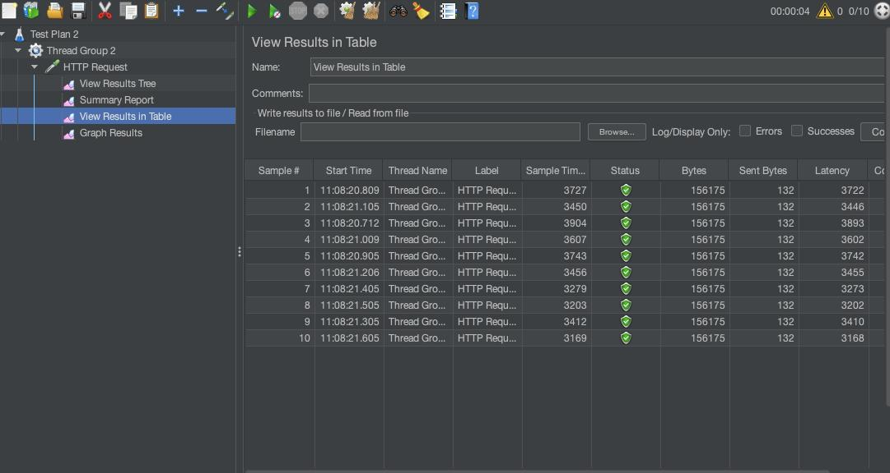
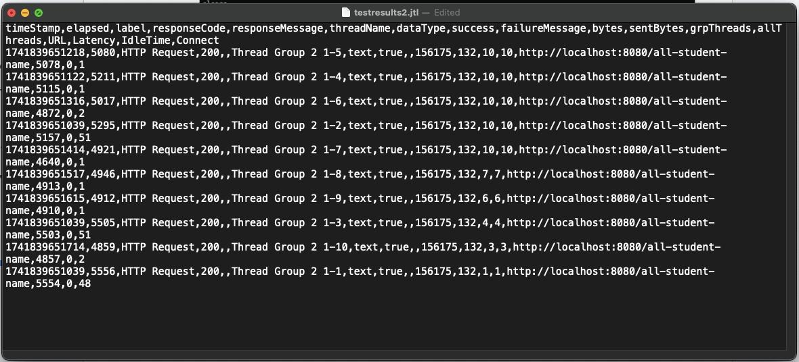
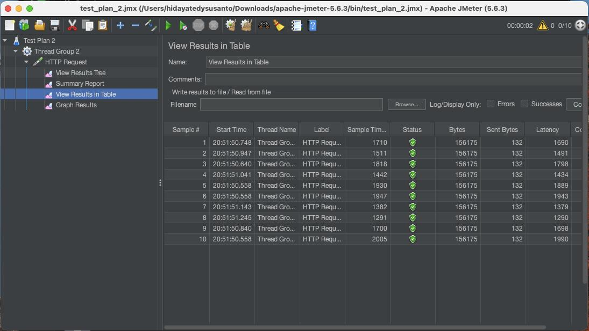
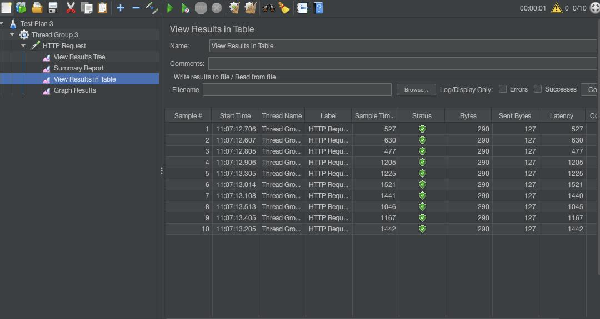
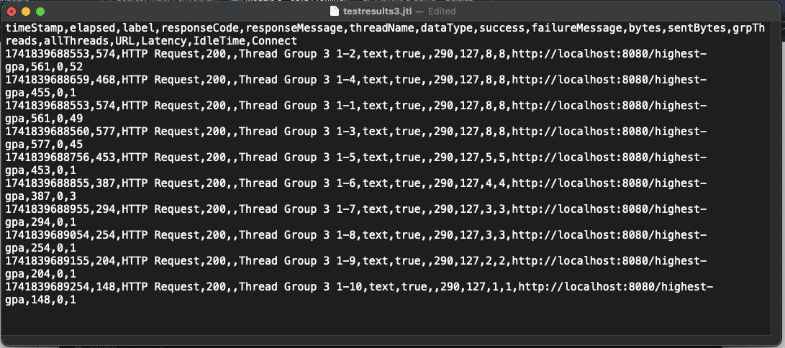
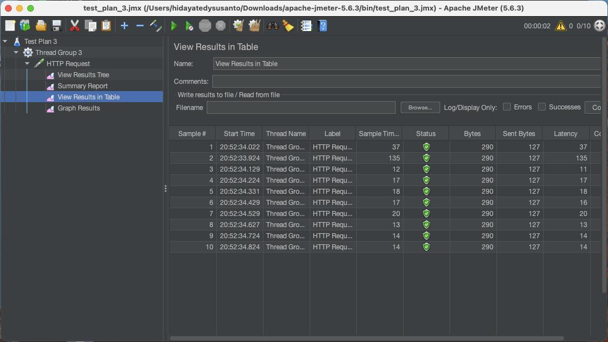

# Module 5

## Reflection 1: Difference of JMeter and IntelliJ Profiler

JMeter is used for overall performance testing in a production-scale environment, benchmarking access time until the page
fully loads. It evaluates the system’s ability to handle real-world traffic and identifies potential bottlenecks.
Meanwhile, IntelliJ Profiler focuses on function performance testing during development, analyzing execution times and
resource usage to pinpoint inefficiencies. By using both tools, developers can ensure optimal performance from both a
high-level and granular perspective, ultimately enhancing the application's efficiency and user experience.

---

## Reflection 2: Profiling advantage

Profiling helps identify functions that may be slowing down the application and can be optimized. In this context, “slow”
refers to functions with high execution time and long running processes. The provided data includes CPU time, total
execution time, CPU usage, and more. With this information, I can pinpoint performance-heavy code sections and optimize
only the areas that require improvement.

---

## Reflection 3: Opinion on IntelliJ Profiler

Yes, using IntelliJ Profiler, I can identify the methods or functions that consume the most time before optimization.
This is known as a bottleneck—a significant performance disparity in a specific part of the code that impacts overall
efficiency. Analysis becomes more manageable as IntelliJ Profiler offers multiple ways to access performance data,
including flame graphs, call trees, method lists, timelines, and events.

---

## Reflection 4: Main challenges

The biggest challenge in performance testing is conducting it on a large scale, as it requires significant time and
resources. During the process, high resource consumption can impact the efficiency of other tasks, leaving waiting as the
only solution. Another challenge lies in refactoring and analyzing the IntelliJ Profiler, which demands keen attention to
detail and creative problem-solving to optimize the code effectively. The best approach is to focus only on the most
performance-heavy methods to maximize efficiency.

---

## Reflection 5: Main benefits

One advantage is that I don’t need external tools for performance testing. Additionally, I can immediately identify the
source of bottlenecks in my application, allowing me to optimize them directly.

---

## Reflection 6: Case handling

Based on my testing, IntelliJ Profiler and JMeter provide consistent results, accurately reflecting both good and poor
application performance. If inconsistencies arise, I will review the testing configurations in both JMeter and IntelliJ
Profiler, as misconfigurations could lead to differing results.

---

## Reflection 7: Optimization strategy

- Reduced method calls and nested iterations in `getAllStudentsWithCourse`. After optimization, iterations are performed
efficiently without nesting, resulting in a complexity that is nearly linear.

- Optimized database queries in `findStudentsWithHighestGpa()`. Instead of retrieving all students, I now use a query
that sorts students by GPA in descending order and limits the result to only the top entry. Additionally, I created a
service function to streamline this process.

- Implemented `StringBuilder` for more efficient string construction. This data structure is preferable over primitive
`String` types when building strings dynamically. To verify functionality, I reran the application, checked the available
endpoints, and ensured the output remained consistent.

---

## Screenshots

### /all-student-name

*__after optimization:__*

Went from ~3,500ms to ~1,500ms (~57.14% improvement)

---

### /highest-gpa

*__after optimization:__*

Went from ~1,000ms to ~80ms (~92% improvement)